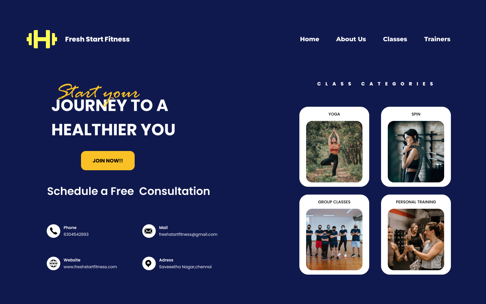

Name:REDDY PAVAN M
Company:CODTECH IT SOLUTIONS
ID:CT6WEHY
Domain:Figma App Development
Duration:Dec to Jan 2025
Mentor:NEELA SANTHOSH
# Fresh Start Fitness - Landing Page Design



## 📋 Description

This repository contains the landing page design for **Fresh Start Fitness**, a conceptual fitness business. The design focuses on a modern, user-friendly layout with a clean structure and engaging visual elements to encourage users to take action and start their fitness journey.

---

## 🎯 Features

- **Bold Call-to-Action**: "Start Your Journey to a Healthier You" with a prominent **Join Now** button.
- **Service Categories**:
  - Yoga
  - Spin
  - Group Classes
  - Personal Training
- **Contact Information**:
  - Phone, Email, Website, and Address sections for easy accessibility.
- **Modern Aesthetic**: A professional color scheme and layout to attract potential customers.

---

## 🖌️ Design Details

- **File Name**: `Frame.png`
- **Primary Colors**:
  - Background: `#0A0E3A` (Dark Blue)
  - Highlights: `#FFD400` (Yellow)
- **Typography**: Clean and modern sans-serif fonts.
- **Images**: Clear and relevant visuals for each class category.

---

## 🚀 Usage

1. **Clone the Repository**:
   ```bash
   git clone https://github.com/yourusername/fresh-start-fitness.git
